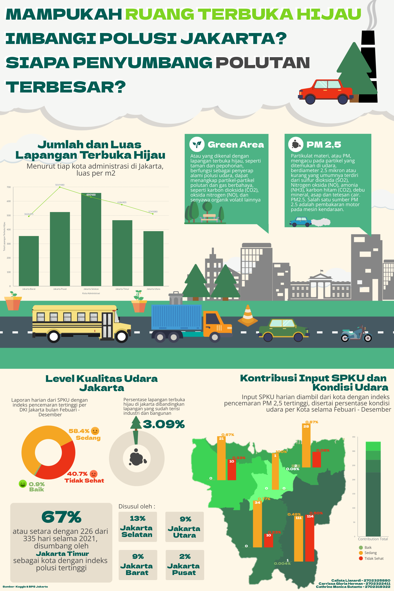

# Jakarta Green Space vs Air Pollution  
### *Data Mining and Visualization Final Project*

This project explores whether **Jakarta’s green open spaces ** can balance the city’s high air pollution levels.  
Using public data and visualization techniques from BPS, it highlights which regions contribute most to air pollutants and how limited green areas impact air quality.

## Objectives
- Analyze the correlation between **green open space (RTH)** and **PM2.5 pollution levels**.  
- Identify the **major contributors of air pollution** in each administrative area.  
- Visualize findings through a clear, data-driven storytelling infographic.

## Key Findings
- **East Jakarta** records the **highest pollution index**, contributing to 67% of poor air quality days.  
- **Average RTH area** across Jakarta only covers **3.09%**, far below ideal coverage.  
- **Vehicle emissions** (PM2.5) remain the top pollutant source.
- Most days in 2021 fell under “**Moderate**” or “**Unhealthy**” air quality categories.

## Data Sources
- **BPS Jakarta** — Green open space data (RTH per city)  
- **Kaggle / BPBD Jakarta** — PM2.5 and air quality index (SPKU)  
- **Visualization Tool:** R + Canva  

## Methods
- Data wrangling and integration in **R**  
- Feature comparison between RTH percentage and PM2.5 levels  
- Visual storytelling using **infographic-style layout**

## Final Output

## Tools
- **R** for data cleaning and visualization  
- **Canva** for infographic layout design  
- **ggplot2**, **dplyr**, **tidyr**

## Team
**Group 10**  
- Calista Lianardi — [2702325880]  
- Caroline Monica Sutanto — [2702284322]  
- Catherine Siobhan Widjaja — [2702319921]
